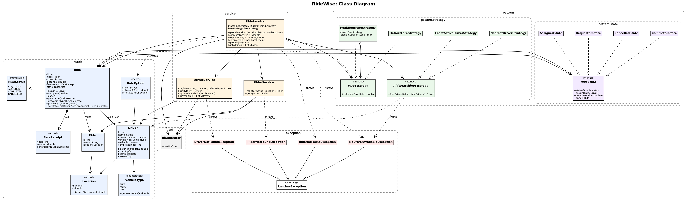

# RideWise: Class Model

## Class diagram
Rendered image: [`Class_Diagram.png`](Class_Diagram.png). `Main` is omitted from the picture because it only wires the objects together (see the packages table).



The packages are drawn as boxes: `model`, `pattern` (containing `pattern.state` and `pattern.strategy`), `service`, `exception` and `util`. The same structure as text (the Mermaid version has no package boxes):

```mermaid
classDiagram
    class Rider { -int id; -String name; -Location location }
    class Driver { -int id; -String name; -Location currentLocation; -VehicleType vehicleType; -boolean available; -int completedRides; +distanceTo(Rider) double }
    class Ride { -int id; -double distance; -RideStatus status; +assignTo(Driver); +complete(double); +cancel() }
    class RideOption { <<record>> Driver driver; double distanceToRider; double estimatedFare }
    class FareReceipt { <<record>> int rideId; double amount; LocalDateTime generatedAt }
    class Location { <<record>> double x; double y }
    class RideStatus { <<enum>> REQUESTED; ASSIGNED; COMPLETED; CANCELLED }
    class VehicleType { <<enum>> BIKE; AUTO; CAR }

    class RideState { <<interface>> +status() RideStatus; +assign(Ride, Driver); +complete(Ride, double); +cancel(Ride) }
    class RequestedState
    class AssignedState
    class CompletedState
    class CancelledState

    class RideMatchingStrategy { <<interface>> +findDriver(Rider, List~Driver~) Driver }
    class NearestDriverStrategy
    class LeastActiveDriverStrategy
    class FareStrategy { <<interface>> +calculateFare(Ride) double }
    class DefaultFareStrategy
    class PeakHourFareStrategy

    class RiderService
    class DriverService
    class RideService
    class IdGenerator
    class RuntimeException
    class NoDriverAvailableException
    class RiderNotFoundException
    class DriverNotFoundException
    class RideNotFoundException

    Ride --> Rider
    Ride --> Driver
    Ride *-- FareReceipt
    Rider --> Location
    Driver --> Location
    Driver --> VehicleType
    Ride --> RideStatus
    Ride --> RideState : current state
    RideState <|.. RequestedState
    RideState <|.. AssignedState
    RideState <|.. CompletedState
    RideState <|.. CancelledState

    RideMatchingStrategy <|.. NearestDriverStrategy
    RideMatchingStrategy <|.. LeastActiveDriverStrategy
    FareStrategy <|.. DefaultFareStrategy
    FareStrategy <|.. PeakHourFareStrategy
    PeakHourFareStrategy o-- FareStrategy : wraps

    RideService o-- RideMatchingStrategy
    RideService o-- FareStrategy
    RideService --> RiderService
    RideService ..> RideOption : creates
    RideOption --> Driver
    RideService --> DriverService
    RideMatchingStrategy ..> NoDriverAvailableException : throws
    RideService ..> NoDriverAvailableException : throws
    RideService ..> RideNotFoundException : throws
    RiderService ..> RiderNotFoundException : throws
    DriverService ..> DriverNotFoundException : throws
    RuntimeException <|-- NoDriverAvailableException
    RuntimeException <|-- RiderNotFoundException
    RuntimeException <|-- DriverNotFoundException
    RuntimeException <|-- RideNotFoundException
    RiderService --> IdGenerator
    DriverService --> IdGenerator
    RideService --> IdGenerator
```



## Packages
| Package | Responsibility |
|---------|----------------|
| `model` | Domain entities and enums: `Rider`, `Driver`, `Ride`, `RideOption`, `FareReceipt`, `Location`, `RideStatus`, `VehicleType`. |
| `pattern` | Parent package that groups the design patterns used by the system. |
| `pattern.strategy` | Strategy pattern: interchangeable algorithms for driver matching (`RideMatchingStrategy` and its implementations) and fare calculation (`FareStrategy` and its implementations). |
| `pattern.state` | State pattern: the `RideState` interface and the four state classes that own the ride lifecycle rules. |
| `service` | Use-case orchestration: register, list, request, complete. |
| `exception` | Domain-specific failures: `NoDriverAvailableException`, `RiderNotFoundException`, `DriverNotFoundException`, `RideNotFoundException`. |
| `util` | `IdGenerator`, an injectable id source. |
| (root) | `Main`: composition root and console menu. |

## Class responsibilities
- **Rider / Driver**: hold identity and position. `Driver` also tracks availability and completed rides, and exposes `distanceTo(Rider)` so strategies never reach into its location.
- **Ride** (State pattern context): aggregates a rider, an optional driver and distance. `assignTo`, `complete` and `cancel` are delegated to its current `RideState`. The ride owns its `FareReceipt`, which a state creates on completion.
- **RideState and its four implementations** (`RequestedState`, `AssignedState`, `CompletedState`, `CancelledState`): each state decides which transitions are legal and performs their side effects (driver availability, receipt, switching to the next state). They are stateless, so one shared public instance each is enough. They live in `pattern.state` and change the ride through `Ride`'s public setters (`setState`, `setDriver`, `setFareReceipt`), which exist only for them.
- **RideOption**: immutable preview row for the rider (driver, distance away, estimated fare), built before any ride exists.
- **FareReceipt**: immutable record of what was charged and when.
- **RideMatchingStrategy**: given a rider and the available drivers, picks one (or none).
- **FareStrategy**: given a ride, returns the fare.
- **RiderService / DriverService**: in-memory registries with lookup and validation.
- **RideService**: coordinates the flow, delegating the "who" to the matching strategy and the "how much" to the fare strategy. `getRideOptions` is a read-only preview of available drivers with estimated fares, `estimateFare` prices a ride that already has a driver, and `requestRide` does the actual booking.

## Ride lifecycle (State pattern)
```
REQUESTED --assignTo(driver)--> ASSIGNED --complete(fare)--> COMPLETED
    |                              |
    +--------- cancel() -----------+--> CANCELLED
```

| Current state | assignTo | complete | cancel |
|---------------|----------|----------|--------|
| REQUESTED | -> ASSIGNED (driver set, becomes unavailable) | illegal | -> CANCELLED |
| ASSIGNED | illegal | -> COMPLETED (receipt created, driver freed and credited) | -> CANCELLED (driver freed, not credited) |
| COMPLETED | illegal | illegal | illegal |
| CANCELLED | illegal | illegal | illegal |

An illegal transition throws `IllegalStateException` with a message such as `Cannot complete ride 3 while it is CANCELLED`. `RideStatus` stays as a simple enum for display and reporting; `ride.getStatus()` asks the current state for its status.

## Exception handling
All custom exceptions extend `RuntimeException` (unchecked), so service signatures stay clean and `Main` handles them in one place.

| Exception | Thrown by | When | Message example |
|-----------|-----------|------|-----------------|
| `RiderNotFoundException` | `RiderService.getRiderById` (used by `RideService.requestRide` and `getRideOptions`) | No rider with the given id | `No rider with id 42` |
| `DriverNotFoundException` | `DriverService.getDriverById` (used by `updateAvailability`) | No driver with the given id | `No driver with id 7` |
| `RideNotFoundException` | `RideService.getRideById` (used by `completeRide`) | No ride with the given id | `No ride with id 99` |
| `NoDriverAvailableException` | `RideMatchingStrategy.findDriver` implementations, then `RideService.requestRide` | The strategy has no driver to return (empty list). `requestRide` catches it, saves the ride as `CANCELLED`, and rethrows with the ride id (original kept as the cause) | `No driver available for ride 3 (marked CANCELLED)` |

Standard Java exceptions are still used for the other two kinds of failure:

| Exception | When |
|-----------|------|
| `IllegalArgumentException` | Invalid input: blank name, non-positive distance, non-numeric text, unknown vehicle type, answer other than y/n |
| `IllegalStateException` | A lifecycle move that is not allowed (for example completing a ride that is already `CANCELLED`), thrown by the `RideState` classes |

`Main.run()` catches them as follows: `NoDriverAvailableException` prints `Sorry: <message>`, and the not-found exceptions, `IllegalArgumentException` and `IllegalStateException` print `Error: <message>`. The menu then continues, so bad input never ends the program.
